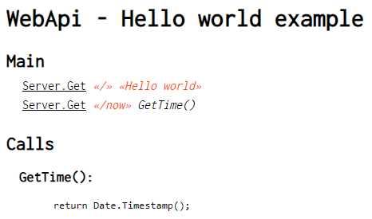
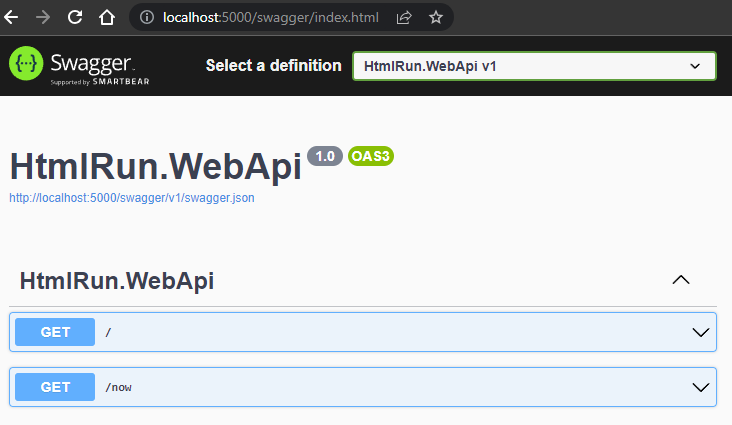

<h1> HtmlGo! </h1>

[](https://github.com/lcnvdl/html-go/actions/workflows/build.yml)
~
[](https://github.com/lcnvdl/html-go/releases)
[](https://github.com/lcnvdl/html-go/releases)
[](https://github.com/lcnvdl/html-go/releases)
~
[](https://twitter.com/acodearla)

The interpreter that lets you 'program' in HTML! Now you can finally join the fun and proudly say you're an HTML programmer (sort of)!

¡El intérprete que te permite 'programar' en HTML! Ahora puedes unirte a la diversión y decir con orgullo que eres un programador de HTML (más o menos)!


## What is HtmlGo?
`HtmlGo` allows you to compile and execute applications in a whole new way. Say goodbye to boring lines of code and embrace a more visual and developer-friendly approach. With `HtmlGo`, all you have to do is write your code in .html files and let its interpreter, developed in NET 6.0, do the rest.

Yes, you heard it right, programming in HTML! But don't worry, it's not like the HTML you know. `HtmlGo` offers a unique way to write instructions using the tags and structure of HTML that you're already familiar with. It's like giving a fresh and creative twist to your programming experience.

The `HtmlGo` interpreter reads your .html file and executes the instructions you've created.

Want to be part of this new way of programming? Join the `HtmlGo` developer community and discover how this language can bring a fun and refreshing twist to your projects. Say goodbye to monotony and welcome a more visual, creative, and HTML-infused programming experience!

## Full Documentation
See the [Wiki](https://github.com/lcnvdl/html-go/wiki) for full documentation, examples, operational details and other information.

## Table of contents
- [What is HtmlGo?](#what-is-htmlgo)
- [Full Documentation](#full-documentation)
- [Table of contents](#table-of-contents)
- [How to use?](#how-to-use)
  - [Terminal mode](#terminal-mode)
  - [Server mode](#server-mode)
- [Getting Started for Users](#getting-started-for-users)
- [Tutorials](#tutorials)
- [Dev tools](#dev-tools)
- [License](#license)

## How to use?
### Terminal mode
Here's a quick guide on how to use `HtmlGo` with commands:

1. Open your terminal or command prompt.
2. Run the following command:
```bash
htmlgo /path/to/app.html
```
Make sure to replace "/path/to/app.html" with the actual path and name of your app.html file.

`HtmlGo` will start interpreting the HTML file and executing the instructions you've created.

And that's it! With these simple steps, you'll be able to run your Html application and see the results in action.

### Server mode


You can use `HtmlGo` as a WebAPI server:

1. Open your terminal or command prompt.
2. Run the following command:
```bash
htmlgo-server /path/to/app.html
```

You can add the `--swagger` parameter to enable Swagger UI:

```bash
htmlgo-server /path/to/app.html --swagger
```



## Getting Started for Users
Before you can start using `HtmlGo` to compile and execute applications, you'll need to perform a simple setup process. This involves downloading the `HtmlGo` package, extracting it to a directory, and configuring your system's environment variables. Follow the steps below to get started:

1. Download the zip file containing the `HtmlGo` package.
2. Extract the contents of the zip file to a directory of your choice.
3. Open the system's environment variables settings.
4. Add the directory path where you extracted `HtmlGo` to the PATH environment variable.
  * For Windows:
    * Press Win + X and select "System".
    * Click on "Advanced system settings".
    * In the "System Properties" window, click on the "Environment Variables" button.
    * In the "Environment Variables" window, under "System variables", select "Path" and click on "Edit".
    * Add the directory path to the list of paths, separating each path with a semicolon (;).
    * Click "OK" to save the changes.
  * For macOS and Linux:
    * Open a terminal window.
    * Run the command nano ~/.bash_profile to edit your bash profile.
    * Add the following line at the end of the file: export PATH="/path/to/htmlgo:$PATH", replacing "/path/to/htmlgo" with the actual directory path where you extracted `HtmlGo`.
    * Press Ctrl + X, then Y, and finally Enter to save the changes.

Once you have completed these steps, you have successfully installed `HtmlGo` on your system. You can now start using `HtmlGo` to compile and execute applications written in HTML.

## Tutorials
* [HtmlGo Playlist (Spanish-Español)](https://www.youtube.com/playlist?list=PLN55oDjIbZw-n1D9bUEykjyBoSS_3D8fn)

Are you a content creator? Send us a pull request with your videos!

## Dev tools
* Commands (list of commands I've used) - `commands.bat`
* Watch (compile and run with hot-reload feature) - `watch.bat`
* Watch-sv (compile and run in server mode with hot-reload feature) - `watch-sv.bat`
* Watch-test (compile and run tests with hot-reload feature) - `watch-test.bat`
* Publish (win-x64 release build) - `publish.bat`
* Publish docker (generates an example docker image) - `publish-docker.bat`
* Publish linux (linux-x64 release build) - `publish-linux.bat`
* Publish plugins (NHibernate) - `publish-plugins.bat`
* Run docker (runs the example docker image) - `run-docker.bat`

## License
Please note that the license specified in this documentation apply specifically to the `HtmlGo compiler` and not to the HTML language itself. The HTML language is free to use, both for commercial and non-commercial purposes.
[Attribution-NonCommercial-NoDerivatives 4.0 International](https://github.com/lcnvdl/html-go/blob/master/LICENSE)
